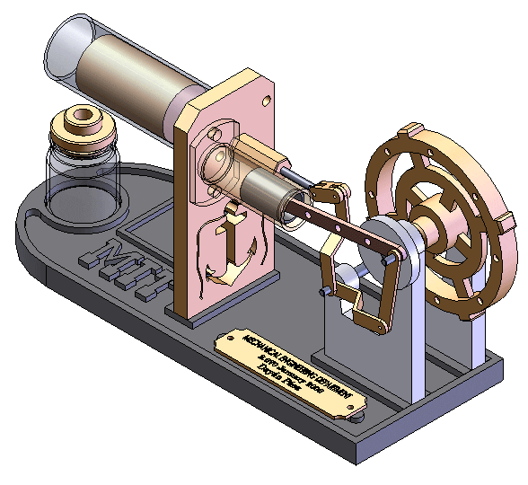

# Servo1-
Mi primer Servo con Arduino

## Descripción de funcionamiento

Este proyecto consistira en un LDR que controle el movimiento de un Servomotor

### Código

~~~
#include <Servo.h>

int intensidad = 0;
int intensidadMapeada = 0;
int servoMax = 150;
int servoMin = 30;

int ldrPin = A0;
Servo myservo;  

int pos = 0;    

void setup() {
  myservo.attach(9);  
}

void loop() {
  intensidad = analogRead(A0);
  intensidadMapeada = map(intensidad, 0, 1023, servoMin,servoMax);
  pos = intensidadMapeada;

    myservo.write(pos);             
                        
  }
~~~

toDo: Subir esquematico

## Imagen Extraida de google

